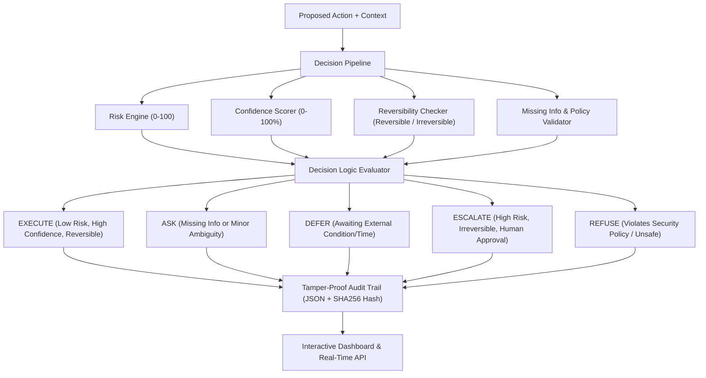

# System Architecture: The Decision Engine

## Flow Description

1. **Input**: A `ProposedAction` is sent to the system containing the domain, action type, payload, and context (user role, IP, time).
2. **Analysis**: The pipeline evaluates the action across four vectors:
   - **Risk Engine**: Calculates a score based on the action's destructive potential and domain.
   - **Confidence Scorer**: Checks if we have enough data and context to be sure of the intent.
   - **Reversibility**: Determines if the action can be easily undone (e.g., dropping a database vs updating a row).
   - **Validator**: Checks for missing fields required for the specific action.
3. **Logic Evaluator**: Combines the signals into one of the 5 mandatory states (`execute`, `ask`, `defer`, `escalate`, `refuse`).
4. **Audit**: The decision is hashed using SHA-256 and appended to a tamper-proof audit log.
